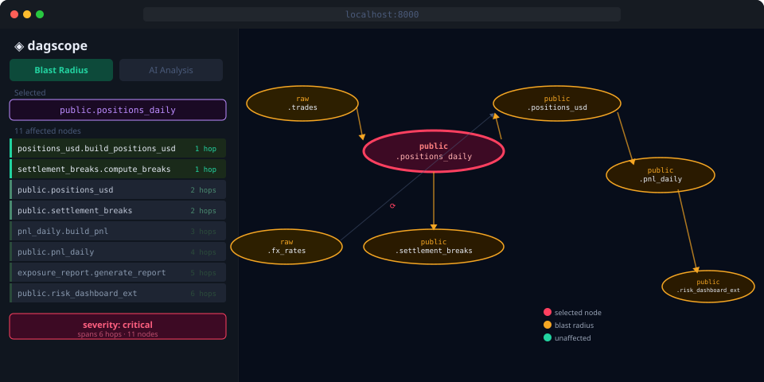
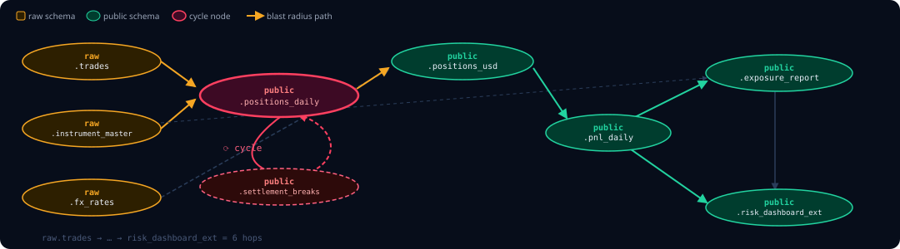
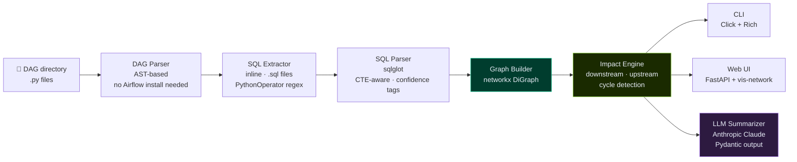
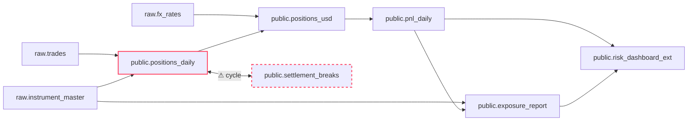

# ◈ dagscope


> **Airflow shows you task dependencies inside a single DAG.**
> dagscope shows you *table* dependencies — including the ones that silently cross DAG boundaries — and tells you exactly what breaks when you change something.



## The Problem

Data platform teams running Airflow hit the same wall: a change to one table silently breaks tables three hops downstream, discovered days later by someone reading a wrong number in a report.

Airflow's UI models task dependencies **within** a DAG. It models nothing about the tables those tasks read and write, and nothing about dependencies that cross DAG boundaries. The graph that actually matters — the one that connects your entire data platform — is invisible.

**dagscope makes it visible.**

## Pipeline — What the Graph Looks Like



Nine tables across four schema layers. Two DAGs share `public.positions_daily` as an intermediary — neither knows about the other. A genuine circular dependency is visible immediately. A "dead" table feeds 12 downstream nodes.

## Demo

### Blast radius of a schema change

```
$ dagscope impact --table public.positions_daily

         Downstream impact of public.positions_daily
┏━━━━━━━━━━━━━━━━━━━━━━━━━━━━━━━━━━━━━━━━━━━━┳━━━━━━━┳━━━━━━┓
┃ Node                                       ┃ Type  ┃ Hops ┃
┡━━━━━━━━━━━━━━━━━━━━━━━━━━━━━━━━━━━━━━━━━━━━╇━━━━━━━╇━━━━━━┩
│ positions_usd.build_positions_usd          │ task  │    1 │
│ settlement_breaks.compute_breaks           │ task  │    1 │
│ public.positions_usd                       │ table │    2 │
│ public.settlement_breaks                   │ table │    2 │
│ pnl_daily.build_pnl                        │ task  │    3 │
│ public.pnl_daily                           │ table │    4 │
│ exposure_report.generate_report            │ task  │    5 │
│ risk_dashboard_export.build_risk_dashboard │ task  │    5 │
│ public.exposure_report                     │ table │    6 │
│ public.risk_dashboard_ext                  │ table │    6 │
└────────────────────────────────────────────┴───────┴──────┘

11 node(s) in blast radius

AI Summary  severity: critical

Changes to public.positions_daily span 6 hops and reach client-facing risk
dashboards and P&L reports. Two immediate dependents (positions_usd,
settlement_breaks) feed reconciliation and reporting pipelines. Validate row
counts and aggregates before deploying any schema change.

Recommended checks:
  • Verify positions_usd row counts against baseline after the next run
  • Check settlement_breaks reconciliation logic with sample trade data
  • Confirm pnl_daily totals match expected values for the test period
```

### Cycle detection — finds real pipeline bugs

```
$ dagscope check --cycles

Graph Summary
  DAGs:   9
  Tasks:  10
  Tables: 12
  Edges:  26 (3 low-confidence)

Found 1 cycle(s):
  Cycle 1: settlement_breaks.compute_breaks → public.settlement_breaks
           → positions_daily.build_positions → public.positions_daily
           → settlement_breaks.compute_breaks
```

> This cycle was found by pure static analysis of SQL files — no live database connection required. `positions_daily` reads from `settlement_breaks` to adjust quantities, and `settlement_breaks` reads from `positions_daily` to detect breaks. Neither DAG knows about the other. Without dagscope, this is invisible.

### Proving a "dead" table is load-bearing

```
$ dagscope impact --table raw.instrument_master

12 node(s) in blast radius
```

`raw.instrument_master` looks unused when you scan the ingestion DAGs. dagscope proves it feeds 12 downstream nodes including the exposure report. Drop it and you break reporting.

## How It Works



Each stage is a **pure function** over the previous stage's output — independently testable and replaceable. The LLM sits at the narration layer only: it receives a pre-computed subgraph and describes it. It never determines the graph. A lineage tool that hallucinates an edge is worse than no tool.

## Cross-DAG Lineage — The Key Insight

If `positions_daily` DAG writes `public.positions_daily`, and `positions_usd` DAG reads it, dagscope connects them **through the table node** without either DAG knowing about the other. Cross-DAG edges are first-class citizens of the graph.



## Quickstart

```bash
git clone https://github.com/MominNaeem/dagscope
cd dagscope
python -m venv .venv && source .venv/bin/activate
pip install -e .

# CLI — runs against bundled sample DAGs, zero config needed
dagscope check  --cycles
dagscope impact --table public.positions_daily --no-llm
dagscope impact --table raw.instrument_master  --no-llm

# Web UI — interactive force-directed graph
dagscope serve
# open http://localhost:8000, click any node to inspect

# AI summaries
export ANTHROPIC_API_KEY=sk-ant-...
dagscope impact --table public.positions_daily
```

## CLI Reference

| Command | What it does |
|---|---|
| `dagscope impact --table <schema.table>` | Downstream blast radius of a table change |
| `dagscope impact --task <dag.task>` | Downstream blast radius of a task change |
| `dagscope impact ... --direction upstream` | Provenance — where does this data come from? |
| `dagscope check --cycles` | Detect circular data dependencies (exits 1 if found) |
| `dagscope graph --output graph.json` | Export full lineage graph as JSON |
| `dagscope serve --port 8000` | Launch interactive web UI |

All commands accept `--dag-dir <path>` (default: `sample_dags`) and `--no-llm` to skip AI summarization.

## Sample Pipeline

Nine DAGs in a trading-and-positions domain, bundled in `sample_dags/`. Each is deliberately seeded with something for dagscope to find:

| Seed | What It Demonstrates |
|---|---|
| `positions_daily` ↔ `settlement_breaks` circular dependency | Cycle detector surfaces a real pipeline bug — outputs are non-deterministic depending on run order |
| `PythonOperator` in `settlement_breaks.py` | SQL inside Python callables is found by regex, tagged `confidence: low` — the tool is explicit about uncertainty |
| `raw.instrument_master` | Looks unused. Impact query proves it feeds 12 downstream nodes. Drop it and break reporting. |
| 6-hop chain `raw.trades` → `risk_dashboard_ext` | Hop-distance ranking shows what's most at risk vs. what's tangentially affected |
| Tables shared across multiple DAGs | Cross-DAG lineage invisible to Airflow's own UI |

## What I Built and Learned

**Graph algorithms applied to a real problem.** BFS reachability (`networkx.single_source_shortest_path_length`) for hop-distance ranking. `simple_cycles` for cycle detection. The interesting part is that the meaningful graph structure only emerges when you unify task and table nodes across every DAG in the folder — neither algorithm is novel, but the graph they operate on is.

**Static analysis without execution.** Built an AST walker that extracts task IDs, operator classes, SQL strings, and `>>` dependency chains from Airflow DAG files without importing or running them. Handles chained operators, list dependencies, and PythonOperator callable source extraction.

**SQL parsing at scale.** sqlglot parses INSERT, CREATE TABLE AS, MERGE, and DELETE statements to extract read/write table sets per task. CTE aliases are resolved so they don't appear as phantom tables. `EXCLUDED`, `NEW`, and `OLD` pseudo-tables are filtered. Multi-statement scripts are split and processed individually. Parse failures are logged and skipped — the tool never crashes on bad SQL, and it prints a success rate at the end.

**Bounded LLM integration.** The model receives a pre-computed JSON subgraph and narrates it — it never touches graph construction. Pydantic v2 validates the output schema and rejects malformed responses. The tool degrades gracefully with `--no-llm` or a missing API key. This boundary is the architectural point: determinism and auditability at the analysis layer, language fluency at the output layer.

**Cross-DAG lineage as a graph problem.** The key insight: task→table and table→task edges from separate DAGs compose into a unified graph automatically through shared table nodes. No explicit cross-DAG wiring needed. A table node connecting two DAGs that share no code is a first-class edge.

**Engineering honesty.** Confidence tagging (high/low edges), published parse success rate, explicit low-confidence warnings in the web UI, graceful API key degradation. Built a tool that is honest about what it does not know.

## Tech Stack

| Layer | Choice | Why |
|---|---|---|
| SQL parsing | `sqlglot` | Best-in-class Python SQL AST, Postgres dialect, CTE-aware |
| Graph | `networkx` | All algorithms already implemented; zero infrastructure |
| Validation | `pydantic v2` | Schema enforcement on LLM output — rejects malformed responses |
| LLM | Anthropic Claude Haiku | Fast, structured JSON output; degrades gracefully without key |
| CLI | `click` + `rich` | Exit code 1 on high severity enables CI gating |
| Web API | `FastAPI` | Async endpoints for 2–3s LLM calls |
| Visualization | `vis-network` | Force-directed layout, zero build step |
| Tests | `pytest` | 33 tests — parser, graph, impact engine, LLM contract |

## Known Limitations

| Limitation | Why |
|---|---|
| Postgres SQL dialect only | Multi-dialect is the biggest scope trap. One dialect done properly beats five done partially. |
| Static analysis only | No live database connection. Static catches changes *before* they ship — that's the point. |
| PythonOperator edges are best-effort | SQL inside callables found by regex, tagged `confidence: low`. Success rate printed on every run. |
| AST parser, not DagBag | DAGs parsed without execution. Dynamic tasks may not fully resolve. DagBag integration is a planned upgrade. |

## Running Tests

```bash
pip install -e ".[dev]"
pytest tests/ -v
```

33 tests covering the DAG parser, SQL extractor, graph builder, and impact engine. The LLM layer is tested at the contract boundary only — Pydantic schema validation against mocked output.

*Built by [Momin Naeem](https://mominnaeem.com) · UWaterloo Computer Engineering*
*Motivated by real data engineering work at GTS Securities — Airflow pipelines, PostgreSQL at scale, and the downstream breaks nobody saw coming.*
